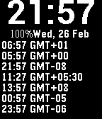

Pebble Watchface For Multiple Timezones
=======================================

PBW binaries available at https://github.com/clach04/pebble_tz/releases

  * Display time, updating once per minute, using system font
  * Display Battery power
  * Display notice when Bluetooth is disconnected
  * Have a config/settings option on Phone to configure:
      * Foreground (time/date/etc. text) color
      * Background color
      * Optional vibrate on Bluetooth disconnect (default is do not vibrate), if enabled does not vibrate during quiet time
      * Offline config support, no need for internet access, so timezones can be updated whilst travelling
      * 7 timezone names and offsets (in minutes, to support partial hour offsets, like India). No DST support.

 

With configuration and settings support via [Clay](https://github.com/clach04/pebble-clay/tree/clach04_emulator_url_index).

Built with https://github.com/clach04/pebble_watchface_framework/

Import into CloudPebble by clicking https://cloudpebble.net/ide/import/github/clach04/pebble_tz/

Using local Pebble SDK also requires node (due to Clay), under Ubuntu:

    sudo apt install nodejs-legacy

App aicon from <a href="http://getdrawings.com/world-icon-png">World Icon Png</a>
